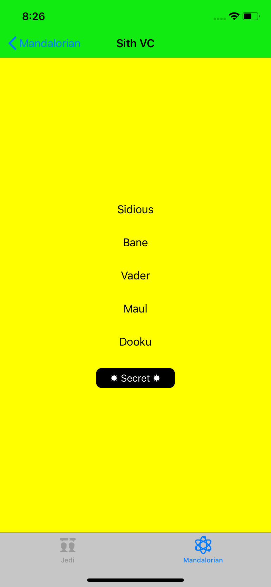

# Tiny Swizzle
### Background
The `TinySwizzle.framework` finds _Dormant_ `Swift` or `ObjC` iOS code.
### Setup
Clone the repo.  Create a `YDSwizzlePlist.plist` file.  Check the `Target Membership` tickbox.  This must be ticked so the plist file ships inside the framework. An example plist:
```
<plist version="1.0">
    <array>
        <dict>
            <key>storyboardClassName</key>
            <string>tinyDormant.YDChewyVC</string>
            <key>storyboardID</key>
            <string>chewyStoryboardID</string>
            <key>storyboardFile</key>
            <string>Main</string>
        </dict>
    </array>
</plist>
```

###  Swizzling
The code focused `dormant ViewControllers` from three places:
1. Storyboard files (or a single Main.storyboard)
2. A `XIB` file
3. A 100% code-only ViewController

Most of the code used a subclass of `UIBarButtonItem` to load a fake button that would access the dormant View Controller.

### What am I looking for?
If you want to target a specific piece of `dormant` code you first perform a `Class Dump`.   Just tick the `Target Membership` box to include the  `dumpClasses.m` file inside of the iOS app's `Target`.  Then it will run the app and print the found classes.
```
[*] 🌠 Started Class introspection...
    [*]tinyDormant.AppDelegate
    [*]tinyDormant.PorgViewController
    [*]tinyDormant.YDJediVC
    [*]tinyDormant.YDSithVC
    [*]tinyDormant.YDMandalorianVC
    [*]tinyDormant.YDPorgImageView
```

### Run (Simulator)
Now get the framework into your app.  The project contained two `Targets`.  An iOS app and a simple framework.  The app just demonstrated what the Swizzle framework could do.  This app worked with a Simulator or real device.

### Run (device with real app)
The framework could be repackaged inside of a real iOS app.  The process was summarised as :
```
- Unzipping the IPA
- Adding the Swizzle framework
- Adding a load command, so the app knew to load the new framework
- Zipping the app contents
- Code signing the modified IPA
```
The commands were as follows:
```
optool install -c load -p "@executable_path/Frameworks/tinySwizzle.framework/tinySwizzle" -t Payload/MyApp.app/MyApp
jtool -arch arm64 -l Payload/MyApp.app/MyApp
7z a unsigned.ipa Payload
applesign -7 -i < DEV CODE SIGNING ID > -m embedded.mobileprovision unsigned.ipa -o ready.ipa
```
### Explaining the code
The Swizzle used the Objective-C `runtime.h` APIs from Apple.  Namely:

- [x]  class_addMethod
- [x]  class_replaceMethod
- [x]  method_exchangeImplementations
- [x]  objc_getClass

Due to `Subclassing`, if you followed the StackOverflow recommendations, and solely used `method_exchangeImplementations`, you could create unexpected behaviour.  Take the `addFakeUIBarButton` example.  You can place the fake bar buttons with the `method_exchangeImplementations` without using `class_addMethod` and `class_replaceMethod`.  But the fake `viewDidLoad` gets called on lots of other classes apart from only the target class `UIViewController`.  You would see it called on `UINavigationController, UIInputWindowController` and `UITabBarController`.
 
### Results
The `Sith` ViewController was 100% code generated. The beauty of Objective-C is you can create these classes at `runtime`:
```
Class SithClass = objc_getClass(dormantClassStr);
id sithvc = class_createInstance(SithClass, 0);
```
After you select the `FakeUIBarButtonItem` it loaded the `ViewController`.



But to invoke the `PorgViewController` you need to find the `ViewController and` the `XIB` file.  Then you can run this line:
```
let porgvc = YDPorgVC(nibName: "PorgViewController", bundle: nil)
```
Notice how you use the ViewController (`YDPorgVC`) to cast the XIB file.  After that, you can choose what option you want to show the code.
```
self.navigationController?.pushViewController(porgvc, animated: true)
```


### What next?
This worked on Objective-C and Swift code.  

- I only tried with Swift code that inherits from `NSObject`.
- Not tried this `SwiftUI`.
