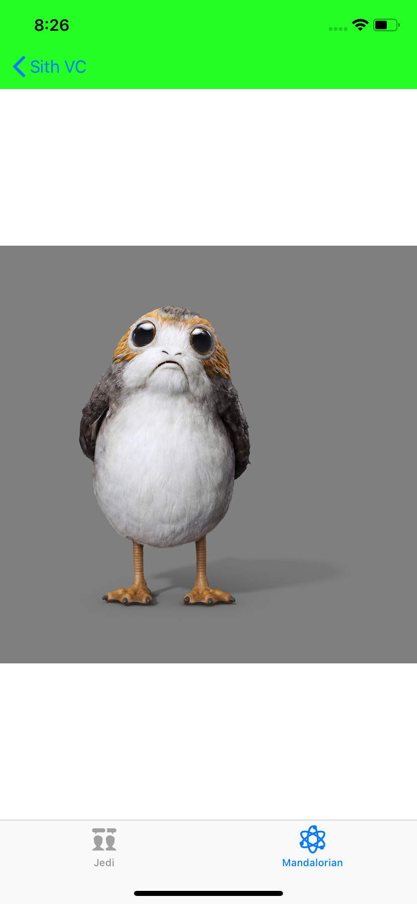

## Tiny Swizzle
### Background
The `TinySwizzle.framework` attempted to find `Dormant` code inside an app, after you have told it what to look for.  

### Method Swizzle
The crux of the code swapped `dormant` code with real code. It worked using the Objective-C `runtime.h` APIs from Apple.  Namely:

- [x]  class_addMethod
- [x]  class_replaceMethod
- [x]  method_exchangeImplementations
- [x]  objc_getClass


### What am I looking for?
Find your "dormant" code by performing a `Class Dump`.   If you want to understand how this works, just tick the `Target Membership` box to include the  `dumpClasses.m` file inside of the iOS app's `Target`.  Then it will run the app and print the found classes.
```
[*] 🌠 Started Class introspection...
    [*]tinyDormant.AppDelegate
    [*]tinyDormant.PorgViewController
    [*]tinyDormant.YDJediVC
    [*]tinyDormant.YDSithVC
    [*]tinyDormant.YDMandalorianVC
    [*]tinyDormant.YDPorgImageView
```
### What next?
Set the values of original and dormant strings.  I did this with a header file that had two #define statements.
```
#define originalClassStr "tinyDormant.YDMandalorianVC"
#define dormantClassStr "tinyDormant.YDSithVC"
```
### Run
Now get the framework into your app.  The project contained two `Targets`.  An iOS app and a simple framework.  The app just demonstrated what the Swizzle framework could do.  The framework could be repackaged inside of a real iOS app or used with an iOS Simulator.  For details on `repackaging` refer to `Applesign`.

### Goal: unlock Dormant code
The Swizzle code inside of `addFakeUIBarButton.m` added a `UIBarButton` to make it clear the code had executed.  Once you selected the button it loaded the dormant class.


### Explaining the code
The `Sith` ViewController was 100% code generated.  It did not rely on a reference inside of `Main.Storyboard` or an XIB file. So I used this API to create it:
```
Class SithClass = objc_getClass(dormantClassStr);
id sithvc = class_createInstance(SithClass, 0);
```
After you select the `UIBarButton` it loads the `ViewController`.


But to invoke the `PorgViewController` you need to find the `ViewController and` the `XIB` file.  Then you can run this line:
```
let porgvc = YDPorgVC(nibName: "PorgViewController", bundle: nil)
```
Notice how you use the ViewController (`YDPorgVC`) to cast the XIB file.  After that, you can choose what option you want to show the code.
```
self.navigationController?.pushViewController(porgvc, animated: true)
```



### What next?
This worked on Objective-C and Swift code.  

- I only tried with Swift code that inherits from `NSObject`.
- Not tried this `SwiftUI`.
